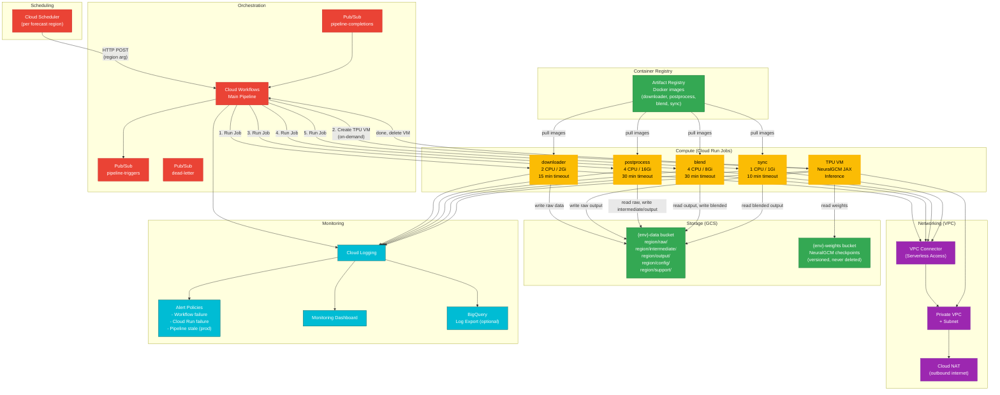

## Cloud Pipeline Architecture

This document describes the GCP-based cloud pipeline that replaces the original cron/HPC-based system.

```mermaid
graph TD
    subgraph Scheduling
        Sched["Cloud Scheduler\n(per forecast region)"]
    end

    subgraph Orchestration
        Sched -- "HTTP POST\n(region arg)" --> Workflow["Cloud Workflows\nMain Pipeline"]
        Workflow --> PubTrigger["Pub/Sub\npipeline-triggers"]
        PubComplete["Pub/Sub\npipeline-completions"] --> Workflow
        DeadLetter["Pub/Sub\ndead-letter"]
    end

    subgraph "Compute (Cloud Run Jobs)"
        Workflow -- "1. Run Job" --> Downloader["downloader\n2 CPU / 2Gi\n15 min timeout"]
        Workflow -- "2. Create TPU VM\n(on-demand)" --> TPU["TPU VM\nNeuralGCM JAX\nInference"]
        TPU -- "done, delete VM" --> Workflow
        Workflow -- "3. Run Job" --> Postprocess["postprocess\n4 CPU / 16Gi\n30 min timeout"]
        Workflow -- "4. Run Job" --> Blend["blend\n4 CPU / 8Gi\n30 min timeout"]
        Workflow -- "5. Run Job" --> Sync["sync\n1 CPU / 1Gi\n10 min timeout"]
    end

    subgraph "Storage (GCS)"
        MainBucket["{env}-data bucket\nregion/raw/\nregion/intermediate/\nregion/output/\nregion/config/\nregion/support/"]
        WeightsBucket["{env}-weights bucket\nNeuralGCM checkpoints\n(versioned, never deleted)"]
    end

    subgraph "Container Registry"
        AR["Artifact Registry\nDocker images\n(downloader, postprocess,\nblend, sync)"]
    end

    subgraph "Networking (VPC)"
        VPCConnector["VPC Connector\n(Serverless Access)"]
        NAT["Cloud NAT\n(outbound internet)"]
        VPC["Private VPC\n+ Subnet"]
    end

    subgraph "Monitoring"
        Logging["Cloud Logging"]
        Alerts["Alert Policies\n- Workflow failure\n- Cloud Run failure\n- Pipeline stale (prod)"]
        Dashboard["Monitoring Dashboard"]
        BQ["BigQuery\nLog Export (optional)"]
    end

    %% Data flow
    Downloader -- "write raw data" --> MainBucket
    TPU -- "read weights" --> WeightsBucket
    TPU -- "write raw output" --> MainBucket
    Postprocess -- "read raw, write intermediate/output" --> MainBucket
    Blend -- "read output, write blended" --> MainBucket
    Sync -- "read blended output" --> MainBucket

    %% Networking
    Downloader & Postprocess & Blend & Sync --> VPCConnector
    VPCConnector --> VPC
    VPC --> NAT
    TPU --> VPC

    %% Images
    AR -- "pull images" --> Downloader & Postprocess & Blend & Sync

    %% Monitoring
    Workflow & Downloader & Postprocess & Blend & Sync & TPU --> Logging
    Logging --> Alerts
    Logging --> BQ
    Logging --> Dashboard

classDef gcp fill:#4285f4,color:#fff,stroke:#1a73e8
classDef storage fill:#34a853,color:#fff,stroke:#137333
classDef compute fill:#fbbc04,color:#000,stroke:#f9ab00
classDef orchestration fill:#ea4335,color:#fff,stroke:#c5221f
classDef network fill:#9c27b0,color:#fff,stroke:#7b1fa2
classDef monitoring fill:#00bcd4,color:#fff,stroke:#006064

class Sched,Workflow,PubTrigger,PubComplete,DeadLetter orchestration
class Downloader,Postprocess,Blend,Sync,TPU compute
class MainBucket,WeightsBucket,AR storage
class VPCConnector,NAT,VPC network
class Logging,Alerts,Dashboard,BQ monitoring
```
